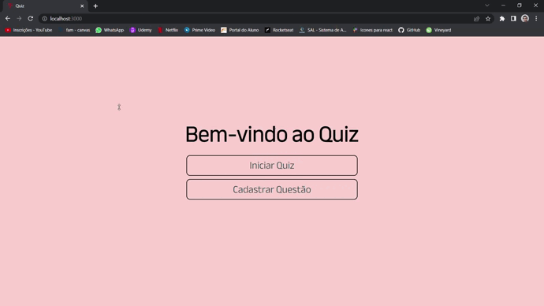
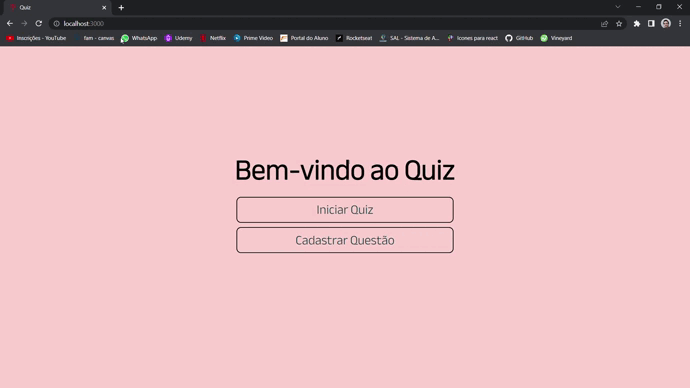

<h1>Quiz</h1>
👨‍💻 Quiz sobre conhecimentos gerais. 
🧑🏽‍🦰 Para jogar basta cadastrar 10 questões e iniciar o jogo. 
🪄 Ao acessar o Quiz ele irá pegar 10 questões aleatórias para mostrar ao jogador. 
🔚 Ao completar as perguntas é mostrado a quantidade de pontos do jogador. 
🤏🏽 Site totalmente responsivo.

<h2>Linguagens utilizadas:</h2>
    <h3>Front-end:</h3>
    - React JS
    <h3>Backend-end:</h3>
    - Node JS com Express como framework 
    - Mongodb junto com Mongoose

    
<h2>Cadastro das Questões</h2>  

<h2>Jogando o Quiz</h2>  

